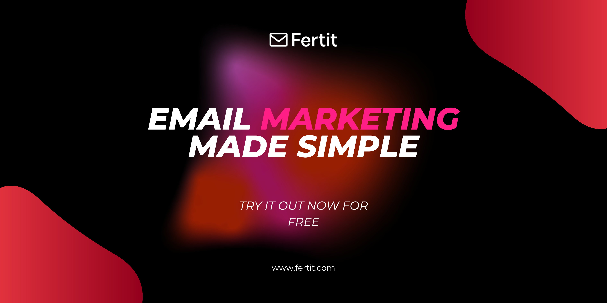

# Mail List Management App



Try it out: [https://www.fertit.com](https://www.fertit.com)

A Go-based web application for sending newsletters and allowing subscribers to manage their preferences. Designed for ease of deployment (Docker-ready), with a modern web UI and admin dashboard.

## Features

- **Admin dashboard**: Login, manage subscribers, and send newsletters.
- **Subscriber portal**: Signup, manage email preferences, and unsubscribe.
- **Rate limiting**: Prevents abuse of subscription endpoints.
- **JWT authentication**: Secure admin session management.
- **SMTP integration**: Send emails using your SMTP provider.
- **PostgreSQL**: Stores subscriber and newsletter data.
- **Redis**: Used for rate limiting and caching.
- **Responsive UI**: HTML templates for dashboard, login, preferences, and success messages.

## Technology Stack

- **Backend**: Go (Gin web framework)
- **Database**: PostgreSQL
- **Cache/Queue**: Redis
- **Frontend**: HTML templates (Go's html/template)
- **Containerization**: Docker, Docker Compose

## Project Structure

```
NewsletterManager/
├── cmd/server/main.go        # Application entry point
├── internal/handlers/        # Route handlers (admin, subscriber, static)
├── internal/services/        # Business logic (auth, email, subscriber, rate limiting)
├── internal/database/        # Database and Redis connection logic
├── web/templates/            # HTML templates (dashboard, login, preferences, etc.)
├── Dockerfile                # Multi-stage build for Go app
├── docker-compose.yml        # Compose file for app, PostgreSQL, Redis
├── .env.example              # Example environment variables
└── ...
```

## Getting Started

### 1. Clone the repository

```bash
git clone https://github.com/rasadov/MailManagerApp.git
cd MailManagerApp
```

### 2. Configure Environment Variables

Copy the example file and fill in your SMTP, DB, and other secrets:

```bash
cp .env.example .env
# Edit .env with your values
```

### 3. Run with Docker Compose

This will start the Go app, PostgreSQL, and Redis:

```bash
docker-compose up --build
```

- App will be available at [http://localhost:8080](http://localhost:8080)
- PostgreSQL at port 5433 (default user/pass from .env)
- Redis at port 6379

### 4. Manual Run (without Docker)

- Install Go 1.23+
- Set up PostgreSQL and Redis (see .env.example for config)
- Build and run:

```bash
go build -o mailmanager ./cmd/server
./mailmanager
```

## Usage

### Admin
- Visit `/admin/login` to access the dashboard
- Credentials set via `ADMIN_USERNAME` and `ADMIN_PASSWORD` in `.env`
- Send newsletters, manage subscribers

### Subscribers
- Homepage: subscribe with email
- `/preferences`: manage subscription topics or unsubscribe

## Environment Variables

See `.env.example` for all options. Key variables:
- `POSTGRES_URL` — PostgreSQL connection string
- `REDIS_ADDR` — Redis address
- `SMTP_HOST`, `SMTP_PORT`, `SMTP_USERNAME`, `SMTP_PASSWORD` — SMTP settings
- `JWT_SECRET`, `JWT_ISSUER` — JWT auth config
- `ADMIN_USERNAME`, `ADMIN_PASSWORD` — Admin credentials
- `BASE_URL` — Public URL of your app

## License

[MIT](LICENSE) or see repository for details.

---

Feel free to open issues or PRs for improvements!
